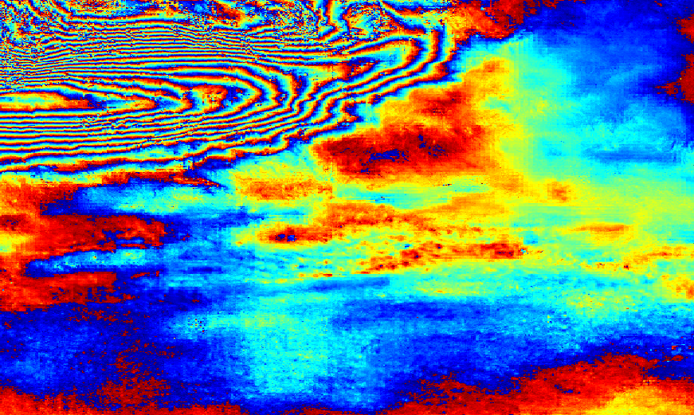
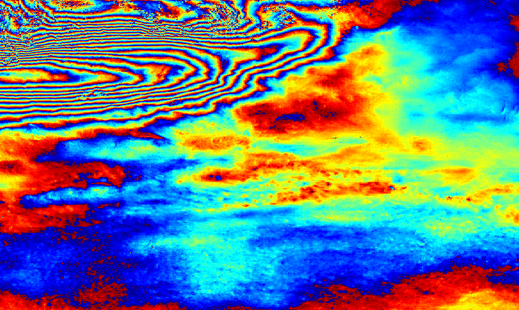

# 改进说明

在 5 月初提交的版本中，滤波出现了较为明显的窗口效应，经过多方请教，现使用反距离加权算法以改进：

反距离加权是一种插值和平滑方法，它根据距离的反比分配权重。本次主要的改进在于增加了一个 "权重矩阵"（`weight`），这个矩阵的大小与滑动窗口大小相同。然后，在每次更新 `out_cpx` 时，都会应用这个权重矩阵，根据距离的反比分配权重。

1. 构造权重矩阵 `weight`。首先，检查 `window_size` 是否为偶数，如果是奇数，则将其减 1；然后，创建一个距离矩阵 `X`，其中 `X[i, j] = i + j`；最后，通过对 `X` 进行翻转和复制，得到完整的权重矩阵 `weight`。
2. 在滑动窗口的遍历过程中，每次都取出一个与当前窗口大小相匹配的权重子矩阵 `ww`。
3. 最后，每次更新 `out_cpx` 的时候，不再是直接将滤波后的窗口赋值给对应的 `out_cpx` 的位置，而是将滤波后的窗口与权重子矩阵 `ww` 进行元素级别的相乘（即Hadamard积），然后加到对应的 `out_cpx` 的位置上。

这样不同位置的像元将会根据其在窗口中的位置（也就是距离中心的距离）得到不同的权重，这使得滤波效果更加平滑，同时也减少了边缘效应。

# V1.0

```matlab
function out_cpx=goldstein_filter(cpx, alpha, window_size, step_size)
% --------------------------------------------
% Goldstein滤波（原算法）
% 输入参数：
%   cpx             需要滤波的干涉图复数矩阵
%   alpha           滤波参数alpha
%   window_size     滑动窗口大小
%   step_size       滑动窗口步长
% 输出：
%   out_cpx         滤波后的干涉图复数矩阵
% --------------------------------------------

% 构造均值卷积核
K = ones(3, 3);
K = K/sum(K(:));
K = fftshift(fft2(K));

[rows,cols]=size(cpx);

% 创建cpx的副本
cpx_copy = cpx;

% 将NaN值替换为0
cpx_copy(isnan(cpx_copy)) = 0;

out_cpx=zeros(rows,cols);
for ii=1:step_size:rows
    for jj=1:step_size:cols
        mm=ii+window_size-1;
        if mm>rows
            mm=rows;
        end
        nn=jj+window_size-1;
        if nn>cols
            nn=cols;
        end
        window=cpx_copy(ii:mm,jj:nn);
        H=fft2(window);
        H=fftshift(H);
        % 使用均值卷积核平滑
        S = conv2(abs(H),K,'same');
        % 归一化 S
        S = S./max(S(:));
        S = S .^ alpha;
        H = H .* S;
        H=ifftshift(H);
        window=ifft2(H);
        out_cpx(ii:mm,jj:nn)=window;
    end
end

% 掩膜原来是空值的像元
idx=angle(cpx)==0;
out_cpx(idx)=0;
idx=isnan(angle(cpx));
out_cpx(idx)=nan;
end
```


# V2.0

```matlab
function out_cpx=goldstein_filter(cpx, alpha, window_size, step_size)
% --------------------------------------------
% Goldstein滤波（添加了反距离加权）
% 输入参数：
%   cpx             需要滤波的干涉图复数矩阵
%   alpha           滤波参数alpha
%   window_size     滑动窗口大小
%   step_size       滑动窗口步长
%
% 输出：
%   out_cpx         滤波后的干涉图复数矩阵
% --------------------------------------------

% 构造均值卷积核
K = ones(3, 3);
K = K/sum(K(:));
K = fftshift(fft2(K));

% 构造权阵
if mod(window_size,2)~=0
    window_size=window_size-1;
end
x=[1:window_size/2];
[X,Y]=meshgrid(x,x);
X=X+Y;
weight=[X,fliplr(X)];
weight=[weight;flipud(weight)];

[rows,cols]=size(cpx);
out_cpx=zeros(rows,cols);

for ii=1:step_size:rows
    for jj=1:step_size:cols
        mm=ii+window_size-1;
        if mm>rows
            mm=rows;
        end
        nn=jj+window_size-1;
        if nn>cols
            nn=cols;
        end
        window=cpx(ii:mm,jj:nn);
        ww=weight(1:(mm-ii+1),1:(nn-jj+1));
        H=fft2(window);
        H=fftshift(H);
        % 使用均值卷积核平滑
        S = conv2(abs(H),K,'same');
        % 归一化 S
        S = S./max(S(:));
        S = S .^ alpha;
        H = H .* S;
        H=ifftshift(H);
        window=ifft2(H);
        out_cpx(ii:mm,jj:nn)=out_cpx(ii:mm,jj:nn)+window.*ww;
    end
end
% 掩膜原来是空值的像元
idx=angle(cpx)==0;
out_cpx(idx)=0;
idx=isnan(angle(cpx));
out_cpx(idx)=nan;
```

# 对比






