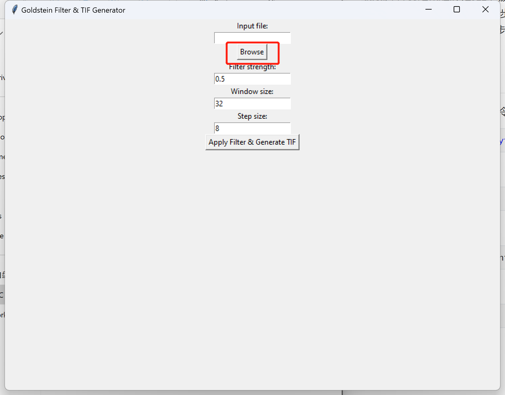
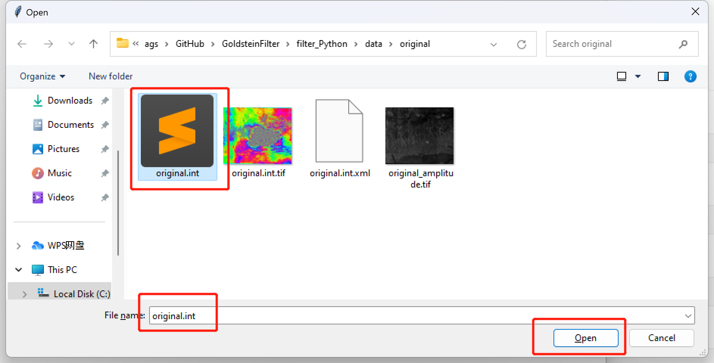
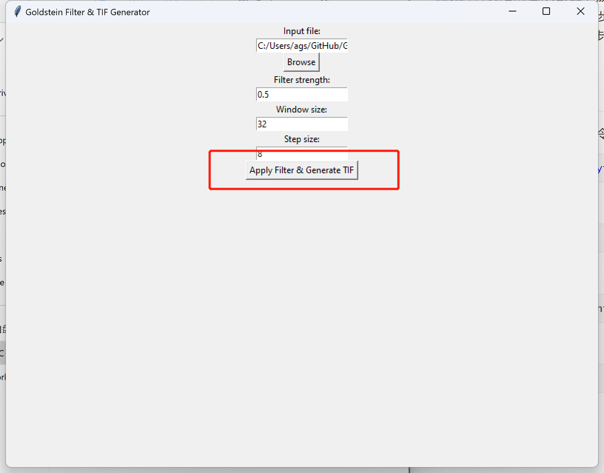
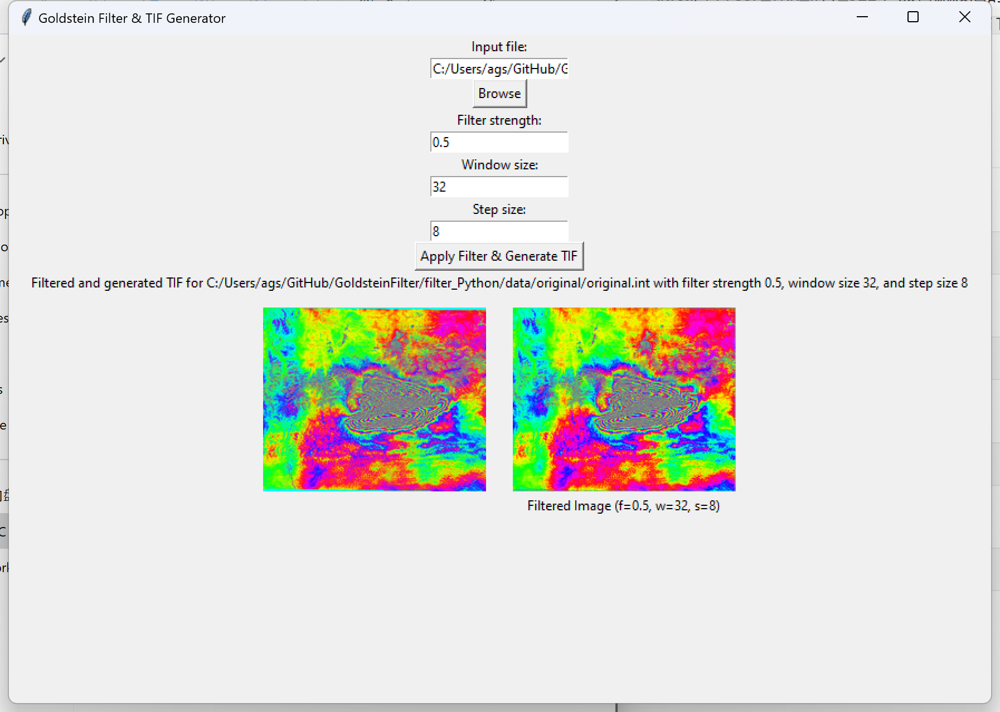
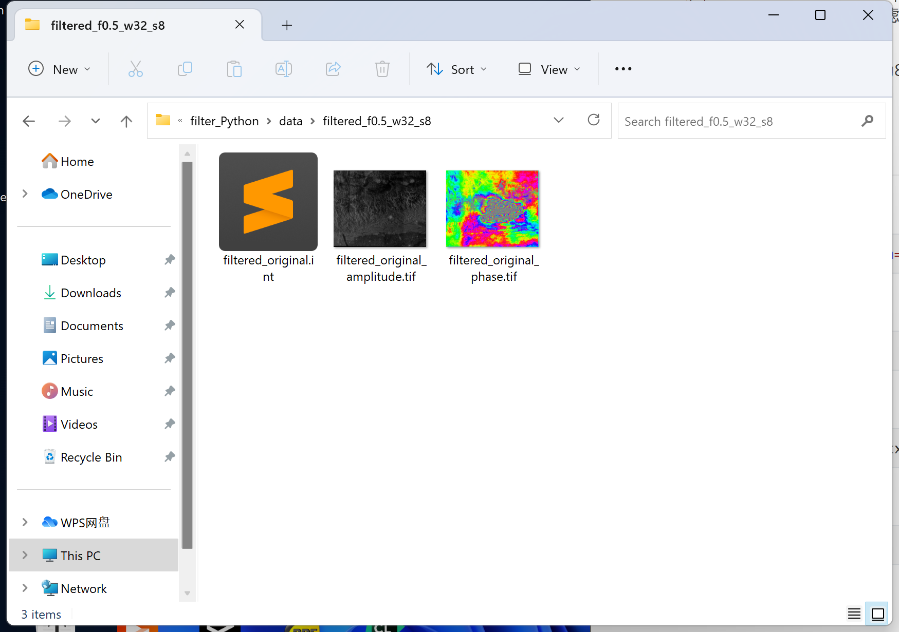

# Goldstein滤波算法及其Python实现

## 文件说明

`main.py`：程序的主函数，负责调用其他函数并绘制GUI界面；

`goldstein_filter.py`：滤波器函数，实现滤波

`gen_tif.py`：将干涉图输出为`tif`格式的图像；

`requirements.txt`：本项目所需要的库；

`data`：放置本工程所需要的相关数据；

`data/original`：放置未经滤波的原图像数据，包含`original.int`、`original.int.tif`、`original.int.xml`和`original_amplitude.tif`

`data/filter_fxx_wyy_szz`：放置滤波后的图像数据，`xx`、`yy`、`zz`分别表示滤波参数、窗口大小、窗口滑动步长，如`filter_f0.5_w32_s8`代表滤波参数为0.5、窗口大小为32、窗口滑动步长为8；

`img`：放置`README`文档的图片。

## 使用指南

1. 创建虚拟环境，使用如下命令：

```shell
conda create -n filter python=3.8
```

2. 打开刚刚创建的虚拟环境：

```shell
conda activate filter
```

3. 安装依赖库：

```shell
pip install -r requirements.txt
```

4. 运行程序：

```shell
python app.py
```

5. 点击`Browse`选择待处理的文件，此处选择`./data/original/original.int`，注意此时与int对应的`original.int.xml`也要在此路径下





6. 点击`Apply Filter & Generate TIF`，开始滤波处理



7. 稍等片刻，处理完成，左边为原始的相位图，右侧为滤波后的相位图



同时，`./data/filtered_f0.5_w32_s8`路径下会产生相应的滤波后的数据


